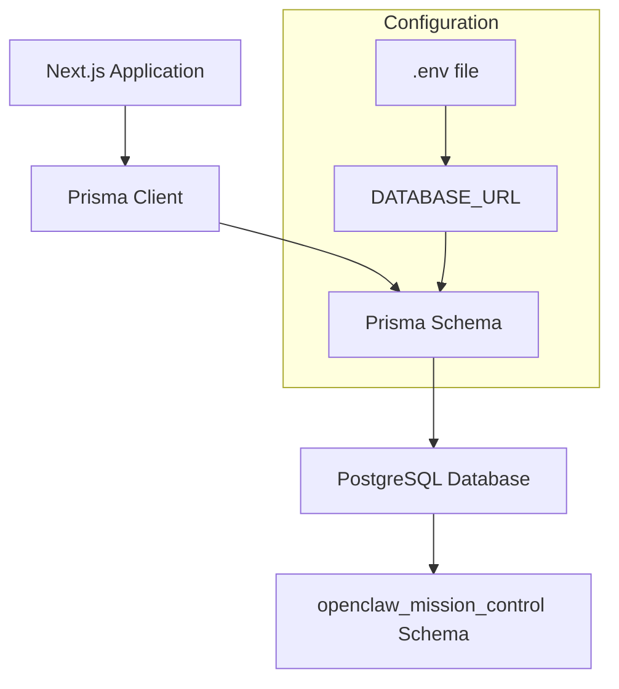

# Prisma PostgreSQL Configuration Plan

## Overview

This plan outlines the steps to configure Prisma for a PostgreSQL database connection in the OpenClaw Mission Control Next.js project.

## Connection Details

| Parameter | Value |
|-----------|-------|
| Host | `<your-database-host>` |
| Port | `5432` |
| User | `<your-username>` |
| Password | `<your-password>` |
| Database | `postgres` |
| Schema | `openclaw_mission_control` |

---

## Step 1: Install Prisma Packages

Run the following terminal commands to install the required Prisma packages:

```bash
npm install prisma --save-dev
npm install @prisma/client
```

---

## Step 2: Create .env File

Create a `.env` file in the project root with the following content:

```env
# PostgreSQL Database Connection
# Note: Special characters in password must be URL-encoded
# ! = %21, / = %2F, @ = %40, # = %23, etc.

DATABASE_URL="postgresql://<username>:<password>@<host>:5432/postgres?schema=openclaw_mission_control"
```

**Important Notes:**
- The password contains special characters that must be URL-encoded:
  - `/` becomes `%2F`
  - `!` becomes `%21`
- The schema parameter is specified in the connection string

---

## Step 3: Initialize Prisma

Run the following command to initialize Prisma:

```bash
npx prisma init
```

This creates:
- `prisma/schema.prisma` - Prisma schema file
- Updates `.env` file if it exists

---

## Step 4: Configure schema.prisma

Replace the contents of `prisma/schema.prisma` with:

```prisma
generator client {
  provider = "prisma-client-js"
}

datasource db {
  provider  = "postgresql"
  url       = env("DATABASE_URL")
  schemas   = ["openclaw_mission_control"]
}

// Example model - adjust based on your actual data model
model Task {
  id          String   @id
  title       String
  description String?
  status      String
  priority    String
  assigneeId  String?
  createdAt   DateTime @default(now())
  updatedAt   DateTime @updatedAt

  @@schema("openclaw_mission_control")
}
```

**Key Configuration Points:**
- `provider = "postgresql"` - Specifies PostgreSQL as the database
- `schemas = ["openclaw_mission_control"]` - Defines the target schema at datasource level
- `@@schema("openclaw_mission_control")` - Required on each model to associate it with the schema

---

## Step 5: Generate Prisma Client

Run the following command to generate the Prisma Client:

```bash
npx prisma generate
```

---

## Step 6: Create Prisma Client Instance (Optional but Recommended)

Create a dedicated file for the Prisma client instance at `lib/prisma.ts`:

```typescript
import { PrismaClient } from '@prisma/client'

const globalForPrisma = globalThis as unknown as {
  prisma: PrismaClient | undefined
}

export const prisma = globalForPrisma.prisma ?? new PrismaClient()

if (process.env.NODE_ENV !== 'production') {
  globalForPrisma.prisma = prisma
}
```

This pattern prevents creating multiple Prisma Client instances during development hot-reloading.

---

## Step 7: Verify Connection (Optional)

To verify the database connection works:

```bash
npx prisma db pull
```

Or to push the schema to the database:

```bash
npx prisma db push
```

---

## Files to Create/Modify

| File | Action |
|------|--------|
| `.env` | Create |
| `prisma/schema.prisma` | Create |
| `lib/prisma.ts` | Create (recommended) |
| `package.json` | Modify (add dependencies via npm install) |

---

## Architecture Diagram



---

## Summary of Commands

```bash
# 1. Install dependencies
npm install prisma --save-dev
npm install @prisma/client

# 2. Initialize Prisma
npx prisma init

# 3. Generate client after schema changes
npx prisma generate

# 4. Optional: Push schema to database
npx prisma db push

# 5. Optional: Open Prisma Studio
npx prisma studio
```
